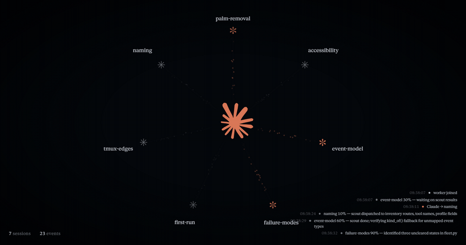
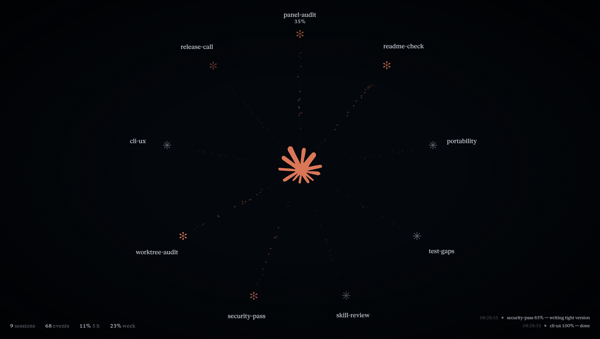

<div align="center">


# Maestro

**Run a dozen Claude Code sessions at once, and let one of them conduct the rest.**

Each agent is a full Claude Code process in a terminal of its own — not a subagent, not an API call. Maestro launches them, reads their screens to know what they are doing, carries messages between them, and draws the whole fleet on a live panel.

[](https://github.com/daniel-madrid-07/Maestro/releases)
[](https://www.python.org/)
[](#requirements)
[](LICENSE)



<sub>Real recording: eight agents auditing this repository. Each wire lights up when a message crosses it, the mark pulses as a new agent joins, and the ticker carries what they just reported.</sub>

</div>

---

## What it does

Claude Code can spawn subagents, but a subagent shares your context window and dies with your turn. Maestro runs **real sessions** instead: separate processes, separate context, separate conversation, all alive at the same time. You keep working in your editor while eight of them build eight parts of your project.

The orchestrator can be Claude itself. Point Claude Code at the `maestro` MCP server and it can launch workers, hand them briefs, poll their status, read their answers, answer their questions and close them — from the session you are already talking to. Or drive it by hand with `maestro status` and the CLI.

Knowing what an agent is doing is the hard part, and Maestro does it the way a person would: it reads the rendered terminal. A spinner means working, an option list means it is waiting for an answer, a finished response means the turn is done. No log parsing, no hooks, no cooperation needed from the agent.

## Features

- **Full sessions, not subagents** — one Claude Code process per worker, in its own terminal, with its own context and its own conversation
- **Agents that delegate** — every session gets an MCP bridge: `assign` a worker without waiting, `handoff` and block for the answer, `send_message` to reply to whoever called you
- **Unstick a worker without touching the keyboard** — `answer_prompt` answers the question it is blocked on, `interrupt` stops a turn that is going in circles, `restart_terminal` gives it a fresh Claude with the same id, directory and queue
- **Isolated git worktrees** — `use_worktree` puts a worker on its own branch in its own checkout, so ten agents on one repository never trample each other; merge with plain git when they are done, and nothing uncommitted is ever thrown away
- **Live panel** — the fleet as a ring of agents around the conductor, wires that light up when a message crosses, a ticker of what just happened, and the state of every agent in its glyph. Installs as a desktop app (PWA); works offline
- **One session at a time** — running three projects at once no longer piles every agent onto a single ring. Each session gets the field to itself; hold both mouse buttons and scroll sideways, or press the arrow keys, to move between them. The sessions you are not watching wait at the edges as breathing arrowheads, one each, warming to orange when a worker there needs an answer and to red when one has failed
- **It tells you when it needs you** — system notifications when an agent asks a question, dies, or freezes for ten minutes with nothing changing on screen
- **Progress you can trust** — agents report their own percentage (`report_progress`); hover a worker to read it, hover the mark for the fleet's mean. No report, no invented number

  

- **Survives a restart** — on Linux and macOS the server re-adopts the tmux sessions that are still alive; everywhere it keeps a note of worktrees whose agent is gone so their work can still be merged
- **Small enough to read** — under 4,000 lines of Python, two dependencies (four on Windows), no database, no web framework

## Installation / Usage

### Windows — one click

Download **[MaestroSetup.exe](https://github.com/daniel-madrid-07/Maestro/releases/latest/download/MaestroSetup.exe)** and run it. Nothing to type, no administrator rights, no restart, no WSL: Maestro runs natively on Windows. The installer sets up what is missing and skips what you already have:

1. **Git for Windows** (per user, checksum-verified) — Claude Code needs its Bash.
2. **uv**, which brings its own Python.
3. **Claude Code**, from Anthropic's own installer.
4. **Maestro**, with its profiles, the skill and the MCP server, so Claude Code in VS Code or the terminal can use it straight away.
5. **Your Claude account** — a window opens and your browser signs you in.
6. **The panel opens** in a window of its own; the Start menu entry *Maestro* reopens it.

The setup file itself is about 2 MB. On a machine with nothing installed it downloads about 200 MB in total (Git, Python and Claude Code); on one that already has them, a few MB.

> The installer is not code-signed yet, so Windows may show *"Windows protected your PC"*: click **More info → Run anyway**. Uninstall it from *Settings → Apps* like anything else; Git, uv and Claude Code stay, since other tools may use them.

### macOS and Linux — one line

```bash
curl -fsSL https://raw.githubusercontent.com/daniel-madrid-07/Maestro/main/install.sh | bash
```

Installs tmux (through your package manager or Homebrew), uv, Claude Code and Maestro, signs you in to Claude if needed, and starts the panel. Run it again at any time: it only does what is missing.

### By hand

```bash
uv tool install git+https://github.com/daniel-madrid-07/Maestro
maestro init      # config, profiles, the skill, and the MCP server in Claude Code
maestro doctor    # checks the terminals, claude, sign-in, the port and the registration
maestro up        # starts the server and opens the panel
```

The same four lines work in PowerShell on Windows.

### Using it

In any project, tell Claude Code what you want built:

> Orchestrate this with Maestro: split it into as many workers as it genuinely divides into, review at the end, and close the sessions when you are done.

Claude launches the fleet, and you watch it on <http://127.0.0.1:9889>.

### Commands

| | |
|---|---|
| `maestro up` | start the server, open the panel (`--foreground`, `--no-open`) |
| `maestro status` | every session and terminal, with status, progress and branch (`--json`) |
| `maestro doctor` | what is missing and how to fix it |
| `maestro open` | open the panel (on Windows, in a window of its own) |
| `maestro down` | stop the server; with tmux the sessions stay up, on Windows they end with it |
| `maestro init` | set up `~/.maestro`, the profiles, the skill, the scout subagent and the MCP registration (`--force`) |

### Requirements

| | |
|---|---|
| **Python** | 3.11 or newer |
| **Claude Code** | installed and signed in (`claude` on `PATH`) |
| **OS** | Windows 10 1809 or newer, macOS, or Linux |
| **Terminals** | Windows: nothing to install (each agent gets a ConPTY, Windows' own pseudo-console). macOS and Linux: tmux 3.0 or newer |

### Profiles

An agent profile is a Markdown file with YAML front matter: model, effort, MCP servers and the system prompt appended to Claude's own. Three ship with Maestro — `worker` (delegates lookups to a cheap scout subagent), `reviewer`, and `code_supervisor` (runs its own workers). Copies land in `~/.maestro/profiles/`, and a file you edit there wins over the packaged one.

## Architecture

- **`maestro-server`** — the HTTP API. Owns the terminals (tmux sessions, or ConPTYs on Windows), starts Claude in each one, reads every screen once a second to classify its state, delivers queued messages when an agent is free, streams events over SSE, and serves the panel.
- **`maestro-ops`** — the MCP server the outside orchestrator (Claude Code in your editor) talks to, registered as `maestro`: `launch_session`, `send_session_message`, `read_session_output`, `get_terminal_status`, `get_terminal_output`, `answer_prompt`, `interrupt`, `restart_terminal`, `list_sessions`, `get_session_info`, `list_profiles`, `get_profile_details`, `list_worktrees`, `remove_worktree`, `shutdown_session`.
- **`maestro-agent`** — the MCP server every launched session gets, so agents can build their own sub-fleets: `assign`, `handoff`, `send_message`, `report_progress`, `list_terminals`, `get_terminal_status`, `get_terminal_output`, `answer_prompt`, `interrupt`, `restart_terminal`, `delete_terminal`.
- **The panel** — a single HTML file served by the server: canvas for the field and the wires, DOM for the labels, SSE for the traffic.

State lives in `~/.maestro/` (config, profiles, logs, worktrees, `state.json`). Nothing leaves your machine except Claude Code's own traffic.

The API binds loopback and has no authentication, because it is a local tool. It sends no CORS headers and refuses any request carrying a foreign `Origin`, so a page you happen to have open in your browser cannot reach it. Do not expose the port.

## Tech stack

Python 3.11 (standard library — `http.server`, `subprocess`, `threading`), [tmux](https://github.com/tmux/tmux) on Linux and macOS, [pywinpty](https://github.com/andfoy/pywinpty) and [pyte](https://github.com/selectel/pyte) on Windows, [Claude Code](https://claude.com/claude-code), the [MCP Python SDK](https://github.com/modelcontextprotocol/python-sdk), PyYAML, and plain HTML/Canvas for the panel.

## License

MIT — see [LICENSE](LICENSE). The terminal-state heuristics are adapted from [awslabs/cli-agent-orchestrator](https://github.com/awslabs/cli-agent-orchestrator) (Apache-2.0); see [NOTICE](NOTICE).
